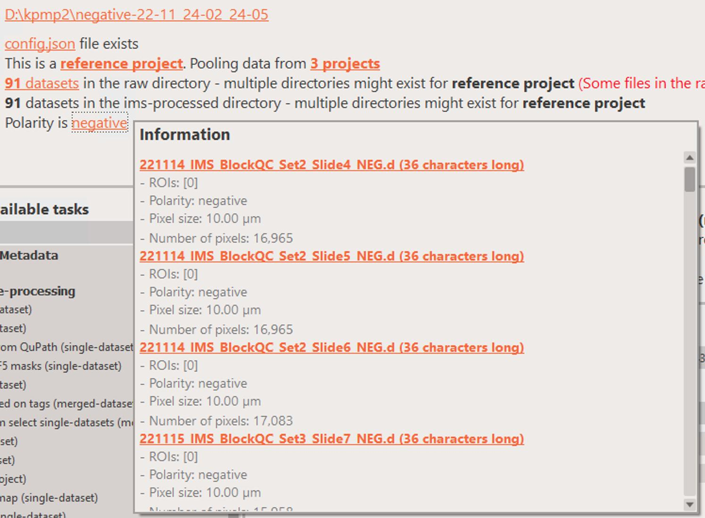

If you click on the `polarity` field in the `about project` section of the user interface, you will be able to see helpful information about each dataset.

<figure markdown>
  
</figure>

The polarity should be either `positive` or `negative`, however, it's possible that the value is also `unknown`. In this case, it's worthwhile checking why this is the case.

!!! warning
    If the `polarity` field says `mixed` then it's usually a sign that you put both `positive` and `negative` datasets together. This is not recommended as it can lead to unexpected results.
