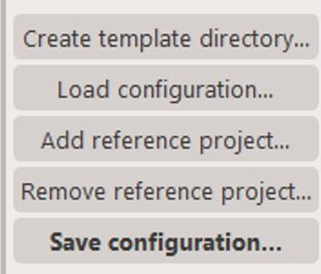
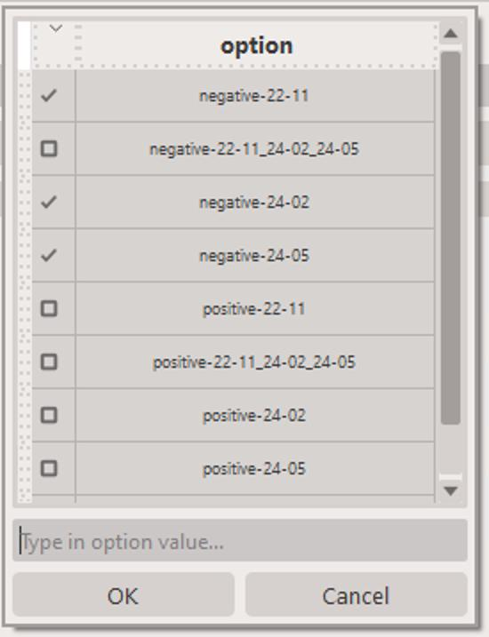
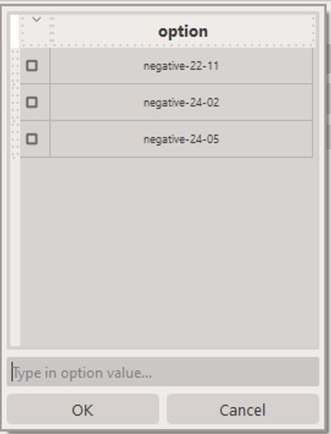

# Reference project

It is now possible to create a `reference` project which combines multiple projects into one.

Imagine you performing long-term research and have acquired samples in batches. You don't want to wait for all the results to be available to start working on them. You can create a project for each batch and then combine them into a `reference` project.

By default, AutoIMS will create `standard`, individual projects, however, it's fairly easy to link several existing projects into a `reference` project.

You can accomplish this by clicking on the `Add reference project...` button the `Actions` section.
<figure markdown>
  
</figure>

We can use the KPMP data as a example. As of writing this guide, we have collected three batches of KPMP data, acquired over the course of ~2 years.
When you click on the `Add reference project...` button, you will be presented with a dialog where you can select the projects you want to include in the reference project.
As shown below, there are several options, including `negative-22-11`, `negative-24-02` and `negative-24-05`. You can select as many or as few as you want.
The second option, `negative-22-11_24-02_24-05` is in fact a reference project that combines all three projects together.

!!! warning
    You cannot mix-and-match polarities! Only projects with the same polarity can be combined into a reference project.

!!! warning
    You cannot include a `reference` project in another `reference` project.

<figure markdown>
  
</figure>

In order to remove a project from a `reference` project, you can click on the `Remove reference project...` button next to the project you want to remove.

<figure markdown>
  
</figure>