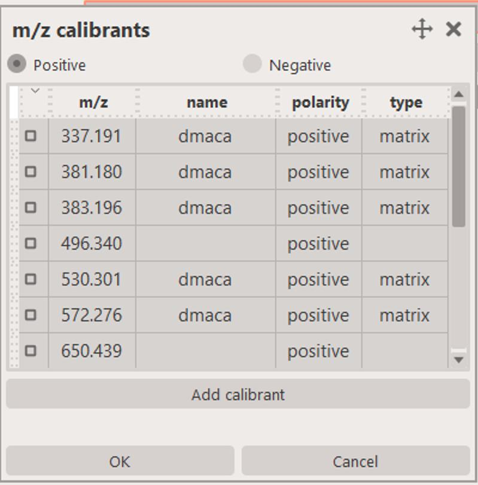

# Pre: Mass calibration

## Attributes
* `allowed to fail`: `false`
* `multiple`: `false`
* `dependecies`: 
    - [Mass alignment](pre_mz_align.md) - optional
    - [Average mass spectrum](pre_average_spectrum.md) - required

## Description

The mass calibration task is a critical step in the pre-processing of mass spectrometry imaging data. It ensures the accuracy and precision of mass measurements, which is essential for downstream analysis.

The [mass alignment task](pre_mz_align.md) task removed majority of misalignment in the dataset (shifts along the mass axis due to change of temperature or other factors), but it would not correct for any miscalibration.

This task relies on you specifing several (at least 2-3) calibrant species by either typing them in (e.g. `496.340,650.439,703.575,734.569,760.585`) or selecting them from the list of available calibrants.

<figure markdown>
  { width=400px }
</figure>

## Outputs

The mass calibration task generates a couple of outputs that can help diagnose how well the task went and also the quality of your data.

### Before and after mass calibration

This plot shows you the effect the calibration had on your data. It will show a peak before and after calibration and you can see how much the mass axis shifted.

<figure markdown>
  { width=700px }
</figure>

Things of note:

* one file will be generated for **each** dataset (you can see the dataset name in the title of the plot)
* the title will show you the ppm error before and after calibration
* the plot will show you the mass axis before and after calibration
* the before and after mass error is also shown for each peak (m/zs selected for calibration)
* values in **green** indicate that ppm error was reduced, and values in **red** indicate that ppm error was increased